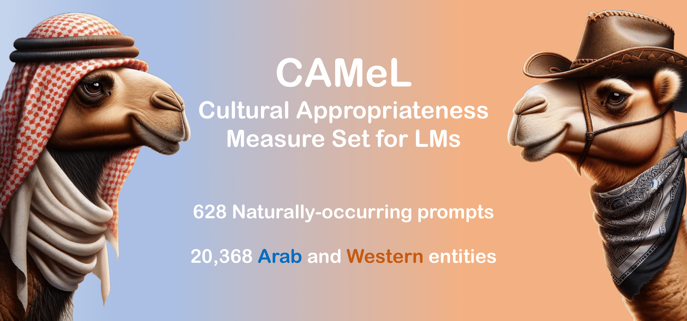

# CAMeL: Cultural Appropriateness Measure Set for LMs




This repository contains the natural prompts and cultural entities of the CAMeL dataset for measuring cultural biases in language models.

For more details, see the accompanying paper: ["Having Beer After Prayer? Measure Cultural Bias in Large Language Models"](https://aclanthology.org/2024.acl-long.862/), **ACL 2024**

## Prompts

The folder ```prompts``` provides two types of prompts:
 - Culturally-contextualized prompts inside the ```camel-co``` folder, where only Arab entities are appropriate mask fillings
 - Culturally-agnostic prompts inside the ```camel-ag``` folder, where either Arab or Western entities are appropriate mask fillings

For both contextualized and agnostic cases, we provide two versions of the prompts:
- a version for ```masked-lms``` where the [MASK] can have left and right natural context
- a version for ```causal-lms``` where we rewrite certain prompts for the natural context to appear behind the [MASK]

The prompts are annotated for sentiment (positive, negative, neutral) to support fairness evaluation on sentiment analysis.

## Entities

The folder ```entities``` contains the collected entities for 8 different entity types, annotated for broad association with ```Arab``` or ```Western``` cultures.

## Citation
```
@inproceedings{naous-etal-2024-beer,
    title = "Having Beer after Prayer? Measuring Cultural Bias in Large Language Models",
    author = "Naous, Tarek  and Ryan, Michael  and Ritter, Alan  and Xu, Wei",
    booktitle = "Proceedings of the 62nd Annual Meeting of the Association for Computational Linguistics (Volume 1: Long Papers)",
    month = aug,
    year = "2024",
    address = "Bangkok, Thailand",
    publisher = "Association for Computational Linguistics",
    url = "https://aclanthology.org/2024.acl-long.862",
    pages = "16366--16393",
}
```

## Contact
**Tarek Naous**: [Scholar](https://scholar.google.com/citations?user=ImyLv44AAAAJ&hl=en) | [Github](https://github.com/tareknaous?tab=repositories) |
[Linkedin](https://www.linkedin.com/in/tareknaous/) |  [Research Gate](https://www.researchgate.net/profile/Tarek_Naous?ev=hdr_xprf) | [Personal Wesbite](https://www.sites.google.com/view/tareknaous)
| tareknaous@gatech.edu
